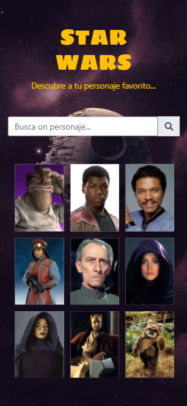
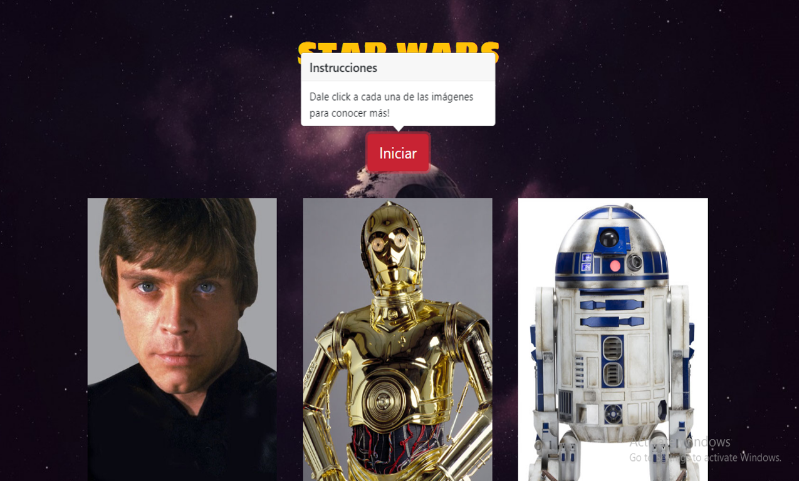
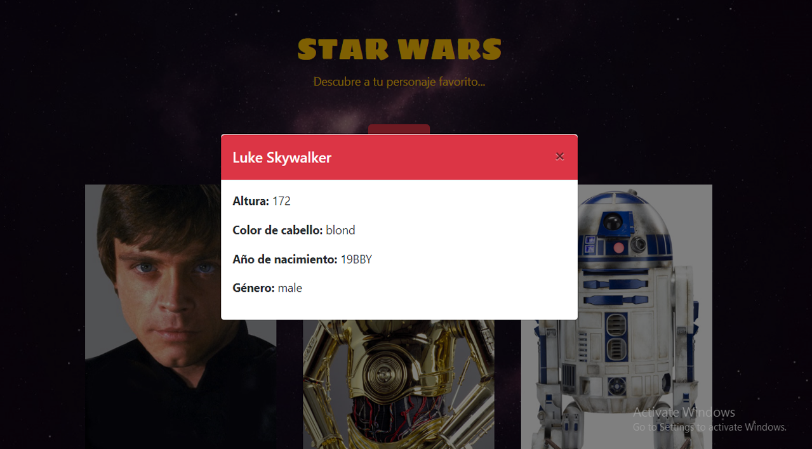

# SWAPI

* **Track:** _FRONT-END-DEVELOPER_
* **Curso:** _Construye una Single Page App (spa) multi-usuario consumiendo data remota_
* **Unidad:** _3_

***

## Introducción 

SWAPI es un buscador de personajes de la saga de Star Wars, donde puedes obtener información sobre el personaje que buscas. 

## Plan de trabajo

El proyecto se desarrolló en un día y se crearon los siguientes issues y milestones que sirven como hoja de ruta (roadmap):

* Elaborar sketch del proyecto.
* Inicializar proyecto con `npm init` y `git init`.
* Configurar servidor.
* Maquetado.
* Primera parte de la funcionalidad (Establecer parámetros de búsqueda e imprimir los resultados en la página).
* Segunda parte de la funcionalidad (Obtener información del API e imprimirla en un modal por cada imagen). 
* Elaborar readme.

## Archivos importantes

El proyecto presenta los siguientes archivos para uso del usuario:

* `README.md` con descripción de la aplicación, uso y ejemplo.
* `index.js`: Archivo js que contiene la funcionalidad de la aplicación.
* `index.html`: Página web de la aplicación.

## Especificaciones

* Se utilizó la librería jQuery en su versión 3.2.1 (como parte del framework bootstrap).
* Se utilizó el framework bootstrap en su versión 4.0.
* Se utilizó el estándar más recientemente aceptado de JavaScript ES2015 || ES6.
* Se utilizó el transpilador/compilador Babel para que convierta nuestro código en ES5 de forma automática.
* Se utilizó el servidor de node.js.
* Mobile first.

***

## Uso
* El usuario debe hacer click en "iniciar" para activar informacion disponible y mostrarlo a travez de un modal.
* Al hacer click sobre la imagen filtrada, el usuario puede ver un modal con toda la información del personaje que busca.

## Ejemplo
* Vista principal del proyecto :

* Vista pop up , al momento de hacer click en "Iniciar" :

* Vista del modal:

***

## Autoras

* Rocci Escobar Nuñez [Cuenta GitHub](https://github.com/Rocciescobar "Repositorio")
* Manuela Flores Vilchez [Cuenta GitHub ](https://github.com/ManuelaFlores "Repositorio")